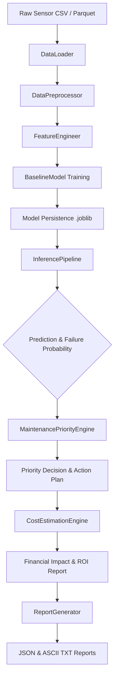

# IoT Predictive Maintenance

> **Enterprise-grade AI-driven predictive maintenance platform for industrial manufacturing.**
> Converts raw IoT sensor telemetry streams into failure predictions, maintenance priorities, financial risk estimates, and actionable operational decisions.

---

## Table of Contents

- [Executive Overview](#executive-overview)
- [System Architecture](#system-architecture)
- [Folder & Module Structure](#folder--module-structure)
- [Installation & Setup](#installation--setup)
- [Quick Start & Usage Examples](#quick-start--usage-examples)
- [Module Reference](#module-reference)
- [Business Intelligence Framework](#business-intelligence-framework)
  - [Maintenance Priority Engine](#maintenance-priority-engine)
  - [Cost & Downtime Estimation Engine](#cost--downtime-estimation-engine)
- [Demonstration Assets & Sample Outputs](#demonstration-assets--sample-outputs)
- [Configuration Layer](#configuration-layer)
- [Future Scope & Roadmap](#future-scope--roadmap)
- [Contributing & Code Standards](#contributing--code-standards)

---

## Executive Overview

Traditional predictive maintenance implementations focus strictly on answering *"Will this machine fail?"* However, operational and maintenance engineering teams require answers to complex business questions before dispatching technicians:

| Operational Question | Provided By Module | Actionable Output |
|---|---|---|
| Will this machine fail? | `src.configs.inference` | Failure Probability & Binary Prediction |
| Which machine needs attention first? | `src.configs.business.maintenance_priority` | Priority Ranking (`CRITICAL`, `HIGH`, `MEDIUM`, `LOW`) |
| What is the maintenance timeframe? | `src.configs.business.maintenance_priority` | Target Maintenance Window (e.g. *"Within 24 Hours"*) |
| What specific actions should be taken? | `src.configs.business.maintenance_priority` | Itemized Operational Action Steps |
| What is the total financial cost of a failure? | `src.configs.business.maintenance_cost` | Repair Cost + Production Loss Exposure ($) |
| Is preventive maintenance financially justified? | `src.configs.business.maintenance_cost` | Net Estimated Savings & Return on Investment (ROI %) |
| How should executive management view risk? | `src.configs.business.maintenance_cost` | Business Risk Level (`VERY HIGH`, `HIGH`, `MEDIUM`, `LOW`) |

---

## System Architecture

```
                                  [ RAW IOT SENSOR DATA ]
                             (CSV / Parquet / Pandas DataFrame)
                                             |
                                             v
+-----------------------------------------------------------------------------------------+
|                                      DATA LAYER                                         |
|    DataLoader (data_loader.py) -------------> DataPreprocessor (preprocessing.py)   |
|    (Ingestion & Validation)                  (Imputation, Normalisation, Encoding)     |
+--------------------------------------------+--------------------------------------------+
                                             |  Cleaned DataFrame
                                             v
+-----------------------------------------------------------------------------------------+
|                                   FEATURE LAYER                                         |
|    FeatureEngineer (feature_engineering.py)                                             |
|    +-- Rolling Statistics (Mean, Min, Max, Std)                                         |
|    +-- Lag & Delta Features (1-step, N-step, first-order difference)                    |
|    +-- Pairwise Interaction Terms (Ratios & Products)                                   |
|    +-- Cyclical Time Encodings (sin/cos of Timestamp)                                   |
|    +-- Variance & Correlation Feature Selection                                         |
+--------------------------------------------+--------------------------------------------+
                                             |  Engineered Feature Matrix
                                             v
+-----------------------------------------------------------------------------------------+
|                                    ML & EVALUATION                                      |
|    BaselineModel (baseline_model.py) --------> ModelEvaluator & EvaluationPipeline      |
|    (RandomForest Training & Joblib Save)       (Confusion Matrix, ROC-AUC, CV Metrics)  |
+--------------------------------------------+--------------------------------------------+
                                             |  Model Artifact (.joblib)
                                             v
+-----------------------------------------------------------------------------------------+
|                                   INFERENCE LAYER                                       |
|    InferencePipeline (inference_pipeline.py)                                            |
|    +-- Model Loading & Data Transformation                                              |
|    +-- InferenceResult Container (Predictions, Probabilities, Confidence Scores)       |
+--------------------------------------------+--------------------------------------------+
                                             |  Predictions + Probabilities
                                             v
+-----------------------------------------------------------------------------------------+
|                                  BUSINESS LAYER                                         |
|                                                                                         |
|  MaintenancePriorityEngine (maintenance_priority.py)                                    |
|  +-- Priority Classification  (CRITICAL / HIGH / MEDIUM / LOW)                          |
|  +-- Risk Escalation (Over-temp > 80°C, Vibration > 8mm/s, Service Overdue > 60 Days)    |
|  +-- Maintenance Window Assignment & Actionable Step Generation                         |
|                                            |                                            |
|                                            v                                            |
|  CostEstimationEngine (maintenance_cost.py)                                             |
|  +-- Base Repair Cost (Interpolated + Age/Hours/Service Penalties)                      |
|  +-- Downtime Hours & Production Loss Exposure                                         |
|  +-- Preventive Maintenance Cost & Net Financial Savings                                |
|  +-- Financial Return on Investment (ROI %) & Business Risk Level                       |
+--------------------------------------------+--------------------------------------------+
                                             |  Decisions & Financial Reports
                                             v
+-----------------------------------------------------------------------------------------+
|                                  REPORTING LAYER                                        |
|    ReportGenerator (report_generator.py)                                                |
|    +-- JSON Machine-Readable Export (outputs/reports/*.json)                            |
|    +-- ASCII Human-Readable Text Reports (outputs/reports/*.txt)                        |
+-----------------------------------------------------------------------------------------+
```

### Pipeline Flowchart (Mermaid)



---

## Folder & Module Structure

```
IoT-Predictive-Maintenance/
├── README.md                              # Enterprise project documentation
├── requirements.txt                       # Project python dependencies
├── .gitignore                             # Git exclusion rules
│
└── data/
    └── notebook/
        ├── outputs/                       # Persistent output directory
        │   ├── models/                    # Saved model artifacts (.joblib)
        │   ├── plots/                     # Evaluation & EDA plots (.png)
        │   └── reports/                   # Generated JSON and TXT reports
        │
        └── src/                           # Source code root
            ├── __init__.py                # Top-level package docstring
            │
            ├── data/                      # Ingestion & preprocessing layer
            │   ├── __init__.py
            │   ├── data_loader.py         # CSV/Parquet loader & file validator
            │   └── preprocessing.py       # Imputation, scaling, categorical encoding
            │
            └── configs/                   # System configurations & ML modules
                ├── __init__.py            # Config layer exports & path helpers
                ├── config.py              # Singleton loader & frozen dataclasses
                ├── config.yaml            # Tunable configuration (Single source of truth)
                │
                ├── business/              # Business intelligence layer
                │   ├── __init__.py
                │   ├── maintenance_priority.py # Priority Engine (CRITICAL/HIGH/MEDIUM/LOW)
                │   └── maintenance_cost.py     # Financial Engine (repair, downtime, ROI)
                │
                ├── evaluation/            # Model evaluation & EDA
                │   ├── __init__.py
                │   ├── eda.py             # Distribution, missing value, & correlation plots
                │   ├── model_evaluation.py # Classification metrics, ROC/PR curves, CV
                │   └── evaluation_pipeline.py # End-to-end evaluation orchestrator
                │
                ├── features/              # Feature engineering
                │   ├── __init__.py
                │   └── feature_engineering.py # Rolling stats, lags, interactions, selection
                │
                ├── inference/             # Inference pipeline
                │   ├── __init__.py
                │   └── inference_pipeline.py  # Canonical model loading & inference engine
                │
                ├── models/                # Machine learning models
                │   ├── __init__.py
                │   └── baseline_model.py  # RandomForest training & persistence
                │
                ├── reports/               # Automated report generation
                │   ├── __init__.py
                │   └── report_generator.py # Structured JSON + ASCII TXT report generator
                │
                └── utils/                 # Utility helpers
                    ├── __init__.py
                    ├── model_manager.py   # Atomic model serialization (save_model/load_model)
                    └── predict.py         # PredictionPipeline (backward-compatibility interface)
```

---

## Installation & Setup

### Prerequisites

- **Python**: Version 3.9 or higher (Python 3.11 recommended)
- **Environment**: Conda or Python `venv`

### Option 1: Conda Environment Setup (Recommended)

```bash
# Clone the repository
git clone https://github.com/Radhe0607/IoT-Predictive-Maintenance.git
cd IoT-Predictive-Maintenance

# Create and activate conda environment
conda create -n iot-pm python=3.11 -y
conda activate iot-pm

# Install dependencies
pip install -r requirements.txt
```

### Option 2: Python Virtual Environment (venv)

```bash
# Clone the repository
git clone https://github.com/Radhe0607/IoT-Predictive-Maintenance.git
cd IoT-Predictive-Maintenance

# Create and activate virtual environment
python -m venv venv

# Linux / macOS:
source venv/bin/activate
# Windows PowerShell:
.\venv\Scripts\Activate.ps1

# Install dependencies
pip install -r requirements.txt
```

---

## Quick Start & Usage Examples

All commands run with `data/notebook` as the working directory so that `src` is properly positioned on the Python path.

### 1. High-Level Inference Pipeline

Execute end-to-end model inference on raw sensor data:

```python
from src.configs.inference import run_inference

# Run inference on input data (CSV path, DataFrame, or dict)
result = run_inference("data/raw/sensor_readings.csv")

# Display formatted results summary
result.display()

# Convert predictions to pandas DataFrame
df_predictions = result.to_dataframe()
```

### 2. Business Maintenance Priority Engine

Evaluate machine urgency from telemetry data and model predictions:

```python
from src.configs.business import MaintenancePriorityEngine, MachineData

engine = MaintenancePriorityEngine()

# Define machine observation
data = MachineData(
    machine_id="CNC-007",
    machine_type="CNC Machine",
    failure_probability=0.95,
    temperature=91.3,
    pressure=8.5,
    vibration=6.2,
    prediction_result=True,
    last_service_days=45,
)

# Generate priority decision
decision = engine.evaluate(data)
engine.display(decision)
```

### 3. Financial Cost & Downtime Estimation Engine

Calculate itemized repair costs, downtime, production losses, and ROI:

```python
from src.configs.business import CostEstimationEngine, CostInput, Priority

engine = CostEstimationEngine()

input_data = CostInput(
    machine_id="CNC-007",
    machine_type="CNC Machine",
    priority=Priority.CRITICAL,
    failure_probability=0.95,
    prediction_result=True,
    machine_age_years=7.0,
    operating_hours=18_500,
    last_service_days=45,
)

# Estimate costs & generate financial report
report = engine.estimate(input_data)
engine.display_report(report)

# Access financial properties
print(f"Total Exposure: ${report.total_failure_cost:,.2f}")
print(f"Preventive Maintenance Savings: ${report.estimated_savings:,.2f}")
print(f"ROI: {report.roi}")
```

### 4. Automated Report Generator

Export structured JSON and human-readable ASCII text reports:

```python
from src.configs.reports import generate_report

# Generate and save report after inference
report = generate_report(inference_result=result, save=True)

# Access generated report paths
print("JSON Report Path:", report.json_path)
print("TXT Report Path:", report.txt_path)
```

### 5. Running Built-in CLI Demonstrations

```bash
cd data/notebook

# Run Maintenance Priority Engine Fleet Demo
python -m src.configs.business.maintenance_priority

# Run Maintenance Cost & Downtime Engine Fleet Demo
python -m src.configs.business.maintenance_cost
```

---

## Module Reference

### Data Layer (`src.data`)

| Module | Primary Class / Function | Purpose & Key Responsibilities |
|---|---|---|
| `data.data_loader` | `DataLoader` | Ingests CSV/Parquet files, validates paths and extensions, surfaces metadata (shape, dtypes). |
| `data.preprocessing` | `DataPreprocessor` | Imputes missing values, scales numerical features via `StandardScaler`, and applies categorical encodings. |

### Feature Engineering (`src.configs.features`)

| Module | Primary Class / Function | Purpose & Key Responsibilities |
|---|---|---|
| `configs.features.feature_engineering` | `FeatureEngineer` | Computes rolling statistics (mean, min, max, std), lag features, deltas, pairwise interactions, cyclical time features, and applies variance/correlation selection. |

### Model Training & Persistence (`src.configs.models`, `src.configs.utils`)

| Module | Primary Class / Function | Purpose & Key Responsibilities |
|---|---|---|
| `configs.models.baseline_model` | `BaselineModel` | Trains a `RandomForestClassifier` with balanced class weights and outputs feature importances. |
| `configs.utils.model_manager` | `save_model`, `load_model` | Handles atomic joblib serialization and deserialization with directory verification. |
| `configs.utils.predict` | `PredictionPipeline` | Backward-compatibility pipeline interface for inference operations. |

### Evaluation & EDA (`src.configs.evaluation`)

| Module | Primary Class / Function | Purpose & Key Responsibilities |
|---|---|---|
| `configs.evaluation.eda` | `EDAAnalyser` | Generates summary statistics, missing value charts, feature boxplots, and correlation heatmaps. |
| `configs.evaluation.model_evaluation` | `ModelEvaluator` | Calculates Accuracy, Precision, Recall, F1, ROC-AUC, confusion matrix, and 5-fold cross-validation. |
| `configs.evaluation.evaluation_pipeline` | `EvaluationPipeline`, `run_evaluation` | Reusable end-to-end evaluation orchestrator linking model loading, evaluation, and reporting. |

### Inference Layer (`src.configs.inference`)

| Module | Primary Class / Function | Purpose & Key Responsibilities |
|---|---|---|
| `configs.inference.inference_pipeline` | `InferencePipeline`, `InferenceResult`, `run_inference` | Canonical inference engine that loads trained `.joblib` models, runs predictions, and returns structured `InferenceResult` containers. |

### Business Layer (`src.configs.business`)

| Module | Primary Class / Function | Purpose & Key Responsibilities |
|---|---|---|
| `configs.business.maintenance_priority` | `MaintenancePriorityEngine`, `MachineData`, `Priority` | Classifies machines into `CRITICAL`, `HIGH`, `MEDIUM`, or `LOW` priority based on failure probability and operational telemetry rules. |
| `configs.business.maintenance_cost` | `CostEstimationEngine`, `CostInput`, `CostReport`, `BusinessRisk` | Computes repair costs, downtime, production losses, preventive maintenance costs, net savings, ROI %, and risk levels. |

### Reporting (`src.configs.reports`)

| Module | Primary Class / Function | Purpose & Key Responsibilities |
|---|---|---|
| `configs.reports.report_generator` | `ReportGenerator`, `PredictiveMaintenanceReport`, `generate_report` | Formats prediction results into structured JSON objects and readable ASCII `.txt` reports in `outputs/reports/`. |

---

## Business Intelligence Framework

### Maintenance Priority Engine

The `MaintenancePriorityEngine` converts raw failure probabilities into operational priorities:

#### 1. Base Priority Mapping
- **Probability $\ge 0.90$**: `CRITICAL`
- **Probability $\ge 0.75$**: `HIGH`
- **Probability $\ge 0.50$**: `MEDIUM`
- **Probability $< 0.50$**: `LOW`

#### 2. Risk Escalation Rules
Priority is escalated by **+1 level** (capped at `CRITICAL`) when any of the following operational conditions are met:
- **Thermal Stress**: Temperature $> 80^\circ\text{C}$
- **Mechanical Vibration**: Vibration $> 8.0\text{ mm/s}$
- **Overdue Maintenance**: Last service $> 60\text{ days}$ ago
- **Combined Sensor Anomaly**: $\ge 2$ sensor features outside normal thresholds
- **High ML Model Confidence**: ML model predicts failure with $\ge 80\%$ confidence

---

### Cost & Downtime Estimation Engine

The `CostEstimationEngine` calculates financial impacts and ROI:

#### 1. Itemized Repair Cost Formula

$$\text{Repair Cost} = \text{Base Repair Cost} \times (1 + \Delta_{\text{age}}) \times (1 + \Delta_{\text{hours}}) \times (1 + \Delta_{\text{service}})$$

- **Base Repair Cost**: Derived via linear interpolation based on failure probability between machine minimum and maximum repair values.
- **Age Penalty ($\Delta_{\text{age}}$)**: $+3\%$ per year of machine age.
- **Operating Hours Wear ($\Delta_{\text{hours}}$)**: $+10\%$ when operating hours exceed $10,000\text{ hours}$.
- **Service Delay Penalty ($\Delta_{\text{service}}$)**: $+8\%$ when last service exceeds $60\text{ days}$.

#### 2. Downtime & Production Loss

$$\text{Production Loss} = \text{Downtime Hours} \times \text{Hourly Production Rate} \times \text{Priority Multiplier}$$

- **Downtime Hours**: Scaled based on priority level and machine complexity.
- **Priority Multipliers**: `CRITICAL`: $1.5\times$, `HIGH`: $1.2\times$, `MEDIUM`: $1.0\times$, `LOW`: $0.8\times$.

#### 3. Preventive Maintenance ROI & Net Savings

$$\text{Total Failure Cost} = \text{Repair Cost} + \text{Production Loss}$$

$$\text{Estimated Savings} = \text{Total Failure Cost} - \text{Preventive Maintenance Cost}$$

$$\text{ROI (\%)} = \left( \frac{\text{Estimated Savings}}{\text{Preventive Maintenance Cost}} \right) \times 100$$

---

## Demonstration Assets & Sample Outputs

### Priority Engine CLI Output Example

Executing `python -m src.configs.business.maintenance_priority`:

```text
===================================================================
  Machine  : CNC-007  [CNC Machine]
  Priority : CRITICAL    (Failure Probability: 95.0%)
  Window   : Within 24 Hours
- - - - - - - - - - - - - - - - - - - - - - - - - - - - - - - - - -
  Reasons:
    1. Failure probability is 95.0% (base classification: CRITICAL)
    2. Temperature 91.3 C exceeds the 80 C safety threshold
    3. ML model predicted FAILURE with 95.0% confidence -- high-confidence positive prediction
- - - - - - - - - - - - - - - - - - - - - - - - - - - - - - - - - -
  Recommended Actions:
    1. Immediately halt machine operation and isolate the unit
    2. Notify maintenance supervisor and safety team without delay
    3. Conduct comprehensive root-cause inspection before restart
    4. Inspect and clean cooling system (fans, heat exchangers, coolant levels)
    5. Inspect lubrication system -- inadequate lubrication causes overheating
    6. Verify that thermal relief valves are functioning correctly
===================================================================
```

### Cost Engine Financial Report Example

Executing `python -m src.configs.business.maintenance_cost`:

```text
============================================================
               Business Maintenance Cost Report             
============================================================

  Machine:                     CNC-007  [CNC Machine]
  Priority:                    CRITICAL
  Failure Probability:         95.0%
  Business Risk:               VERY HIGH

  ------------------------------------------------------------
  Financial Impact Summary
  ------------------------------------------------------------
  Estimated Repair Cost:       $     3,567
  Estimated Downtime:          23.4 Hours
  Production Loss:             $    15,795
  Total Failure Cost Exposure: $    19,362
  Asset Replacement Value:     $    31,167

  ------------------------------------------------------------
  Preventive Maintenance ROI Analysis
  ------------------------------------------------------------
  Preventive Maintenance Cost: $     1,212
  Estimated Savings:           $    18,150
  Return on Investment (ROI):        1498%

  ------------------------------------------------------------
  Cost Breakdown
  ------------------------------------------------------------
    Base Repair Cost:          $  2,435.00
    Age Surcharge:             $    693.97
    Hours Wear Surcharge:      $    243.50
    Service Overdue Surcharge: $    194.80
    Production Loss:           $ 15,795.00
    Total Failure Cost:        $ 19,362.28
    Preventive Cost:           $  1,211.84
    Estimated Savings:         $ 18,150.44
============================================================
```

### JSON Financial Report Schema Example

```json
{
    "machine_id": "CNC-007",
    "machine_type": "CNC Machine",
    "priority": "CRITICAL",
    "failure_probability": 0.95,
    "business_risk": "VERY HIGH",
    "repair_cost": 3567.28,
    "replacement_cost": 31166.67,
    "downtime_hours": 23.4,
    "production_loss": 15795.0,
    "total_failure_cost": 19362.28,
    "preventive_cost": 1211.84,
    "estimated_savings": 18150.44,
    "roi": "1498%",
    "roi_pct": 1497.8,
    "recommendations": [
        "Immediate maintenance required -- halt production and schedule emergency repair within 24 hours to avoid unplanned failure",
        "Emergency repair estimated at $3,567; inaction risks $15,795 in production losses",
        "Preventive maintenance ROI is 1498% -- investing $1,212 now saves an estimated $18,150"
    ]
}
```

---

## Configuration Layer

All tunable project parameters are centrally stored in `data/notebook/src/configs/config.yaml`:

```yaml
model:
  target_col: "failure"
  test_size: 0.20
  n_estimators: 200
  class_weight: "balanced"

evaluation:
  cv_folds: 5
  confidence_threshold: 0.50

feature_engineering:
  rolling_windows: [3, 5, 10]
  lag_steps: [1, 3, 5]
  variance_threshold: 0.01
  correlation_threshold: 0.95

logging:
  level: "INFO"
  format: "%(asctime)s [%(levelname)s] %(name)s -- %(message)s"
```

Access configuration anywhere in Python:

```python
from src.configs import get_config, get_model_path, get_reports_dir

cfg = get_config()  # Singleton accessor (reads YAML once)
model_path = get_model_path(cfg)
reports_dir = get_reports_dir(cfg)
```

---

## Future Scope & Roadmap

- **Streaming Ingestion**: Integration with Apache Kafka and Apache Flink for real-time sensor stream ingestion.
- **Deep Learning Architectures**: Implementation of LSTM networks and Temporal Convolutional Networks (TCN) for long-sequence temporal dependency modeling.
- **Automated Work-Order Dispatching**: Direct API integrations with enterprise CMMS / ERP systems (SAP PM, IBM Maximo, ServiceNow).
- **Cloud-Native Infrastructure**: Deployment helm charts and infrastructure-as-code for AWS IoT Core, Azure IoT Hub, and Kubernetes clusters.

---

## Contributing & Code Standards

We follow strict engineering guidelines across the project:

1. **Docstrings**: Every public function and class requires a NumPy-style docstring detailing `Parameters`, `Returns`, and `Raises`.
2. **Type Hints**: Strict type hinting on all public function signatures.
3. **Logging**: Mandatory logging via `logging.getLogger(__name__)`. No bare `print()` calls in core library code.
4. **Configuration**: Single source of truth via `config.yaml` and `get_config()`.

### Code Verification Check

Before submitting a Pull Request, verify module compilation and run the business engine demos:

```bash
cd data/notebook

# Verify compilation of all Python modules
python -c "import py_compile, glob; [py_compile.compile(f, doraise=True) for f in glob.glob('src/**/*.py', recursive=True)]"

# Run business engine tests
python -m src.configs.business.maintenance_priority
python -m src.configs.business.maintenance_cost
```

---

*Designed for Enterprise Industrial AI, Smart Manufacturing, and Predictive Maintenance Platforms.*
